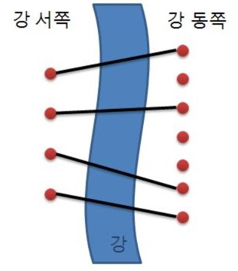

다리 놓기
============
|시간 제한|메모리 제한|
|:---:|:---:|
|0.5초|128MB|

## 문제
-------
재원이는 한 도시의 시장이 되었다.</br>
재원이는 서쪽의 사이트와 동쪽의 사이트를 다리로 연결하려고 한다.</br>
(이때 한 사이트에는 최대 한 개의 다리만 연결될 수 있다.)</br>
재원이는 다리를 최대한 많이 지으려고 하기 때문에 서쪽의 사이트 개수만큼 (N개) 다리를 지으려고 한다.</br>
다리끼리는 서로 겹쳐질 수 없다고 할 때 다리를 지을 수 있는 경우의 수를 구하는 프로그램을 작성하라.</br>


## 입력
-------
입력의 첫 줄에는 테스트 케이스의 개수 T가 주어진다.</br>
그 다음 줄부터 각각의 테스트케이스에 대해 강의 서쪽과 동쪽에 있는 사이트의 개수 정수 N, M (0 < N ≤ M < 30)이 주어진다.</br>

## 출력
-------
각 테스트 케이스에 대해 주어진 조건하에 다리를 지을 수 있는 경우의 수를 출력한다.</br>

## 예제 1
-------
### 입력
```
3
2 2
1 5
13 29
```
### 출력
```
1
5
67863915
```
