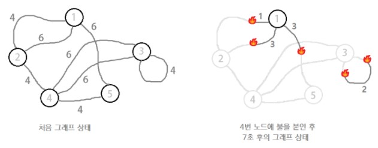

Ignition
============
|시간 제한|메모리 제한|
|:---:|:---:|
|1초|64MB|

## 문제
-------
서훈이는 오늘 있었던 알고리즘 과목 기말고사를 망쳐서 기분이 좋지 않다.</br>
서훈이는 스트레스도 풀 겸 시험 문제로 나온 그래프를 불로 태우려고 한다.</br>


서훈이는 그래프의 정점 (위 그림에서 동그라미로 표시된 곳) 중 한 곳에 불을 붙일 수 있다.</br>
정점에 불이 붙으면 곧바로 노드와 연결된 간선을 따라서 불이 전달된다.</br>
간선 위에서는 불은 1초당 1만큼의 거리를 이동한다.</br>
만약 어떤 간선의 양 끝 정점에 불이 붙은 경우 불은 간선의 중앙까지 태운 후 꺼진다.</br>

서훈이는 그래프를 최대한 빠른 시간 안에 전부 태우고 싶어한다.</br>
서훈이를 도와 어떤 정점에 불을 붙일지 구하는 프로그램을 작성하여라.</br>
단, 위 그림에서 간선끼리 교차하는 것은 무시한다.</br>

## 입력
-------
첫 번째 줄에는 그래프의 정점의 수 N과 간선의 수 M이 주어진다. (2 ≤ N ≤ 200, N-1 ≤ M ≤ 20,000)</br>
두 번째 줄부터 M개의 줄에는 각 간선의 시작점 S, 끝점 E, 길이 L이 주어진다. (1 ≤ L ≤ 100)</br>
시작점과 끝점이 같은 간선도 있을 수 있으며, 특정 두 정점을 직접 연결하는 간선의 수가 여러 개일 수 있다.</br>
또한, 그래프의 모든 정점들은 간선들을 통해서 연결되어 있다.</br>

## 출력
-------
주어진 그래프를 모두 태우는 데 걸리는 최소 시간을 출력한다.</br>
답은 소수점 아래 한 자리까지 출력한다.</br>
문제의 특성 상 오차가 생길 일이 없으므로 출력 데이터와 정확히 일치해야 정답으로 처리한다.</br>

## 예제 1
-------
### 입력
```
5 8
1 2 4
1 2 6
1 5 6
2 4 4
4 5 4
3 4 6
3 4 6
3 3 4
```
### 출력
```
9.0
```

## 예제 2
-------
### 입력
```
5 10
1 2 1
2 3 1
3 4 1
4 5 1
1 3 10
2 4 10
3 5 10
1 4 7
2 5 7
1 5 9
```
### 출력
```
6.5
```
