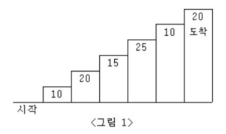
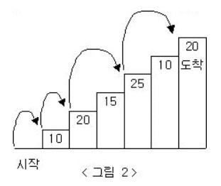

다이얼
============================
|시간 제한|메모리 제한|
|:---:|:---:|
|1초|128MB|

## 문제
-------
계단 오르기 게임은 계단 아래 시작점부터 계단 꼭대기에 위치한 도착점까지 가는 게임이다.</br>
<그림 1>과 같이 각각의 계단에는 일정한 점수가 쓰여 있는데 계단을 밟으면 그 계단에 쓰여 있는 점수를 얻게 된다.</br>



예를 들어 <그림 2>와 같이 시작점에서부터 첫 번째, 두 번째, 네 번째, 여섯 번째 계단을 밟아 도착점에 도달하면 총 점수는 10 + 20 + 25 + 20 = 75점이 된다.</br>



계단 오르는 데는 다음과 같은 규칙이 있다.</br>

계단은 한 번에 한 계단씩 또는 두 계단씩 오를 수 있다.</br>
즉, 한 계단을 밟으면서 이어서 다음 계단이나, 다음 다음 계단으로 오를 수 있다.</br>
연속된 세 개의 계단을 모두 밟아서는 안 된다.</br>
단, 시작점은 계단에 포함되지 않는다.</br>
마지막 도착 계단은 반드시 밟아야 한다.</br>
따라서 첫 번째 계단을 밟고 이어 두 번째 계단이나, 세 번째 계단으로 오를 수 있다.</br>
하지만, 첫 번째 계단을 밟고 이어 네 번째 계단으로 올라가거나, 첫 번째, 두 번째, 세 번째 계단을 연속해서 모두 밟을 수는 없다.</br>

각 계단에 쓰여 있는 점수가 주어질 때 이 게임에서 얻을 수 있는 총 점수의 최댓값을 구하는 프로그램을 작성하시오.</br>

## 입력
-------
첫째 줄에 알파벳 대문자로 이루어진 단어가 주어진다.</br>
단어의 길이는 2보다 크거나 같고, 15보다 작거나 같다.</br>

## 출력
-------
첫째 줄에 다이얼을 걸기 위해서 필요한 최소 시간을 출력한다.</br>

## 예제 1
-------
### 입력
```
UNUCIC
```
### 출력
```
36
```
